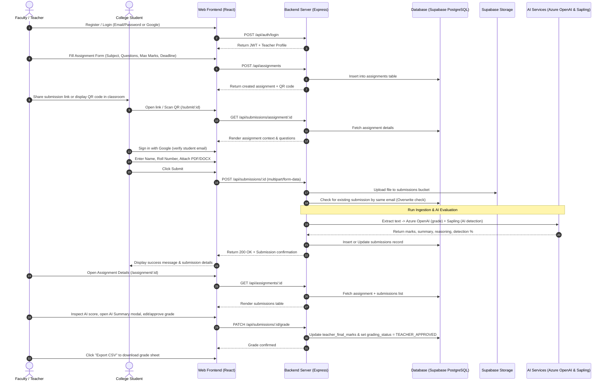

# 01. Project Overview — SubmitBridge

**Academic Project Type:** BCA Minor Project  
**Project Title:** SubmitBridge — AI-Assisted Academic Assignment Submission & Evaluation Portal  
**Domain:** Educational Technology (EdTech) / Cloud-Based Academic Management Systems  

---

## 1. Project Purpose

**SubmitBridge** is a modern, cloud-native digital assignment submission and preliminary evaluation platform developed for college departments, faculty members, and students. It bridges the communication and logistical gap between teachers creating coursework and students submitting assignments.

The platform eliminates the need for paper submissions, physical queues, and lost file attachments in personal email/WhatsApp inboxes. It provides faculty with a central management portal to create assignments, generate permanent shareable submission links and QR codes, track submissions in real time, view automated AI-assisted grades and AI-content likelihood flags, and export grades directly into CSV spreadsheets.

---

## 2. Problem Statement

In contemporary higher education institutions (such as colleges offering BCA, B.Sc. IT, and B.Tech courses), assignment submission and grading face major challenges:

1. **Manual Handling & Physical Clutter:** Handwritten submissions or printed copies lead to heavy paper wastage, logistical clutter, physical loss of documents, and difficulty in archiving.
2. **Disorganized Digital Submissions:** When teachers request submissions via email or messaging apps, files get mixed up, names/roll numbers are inconsistently formatted, duplicate emails clutter inboxes, and version tracking becomes impossible.
3. **Delayed Feedback Loops:** Teachers carry heavy evaluation loads, taking weeks to return feedback on basic assignments, which delays student learning.
4. **Academic Integrity Blindspots:** With the rapid proliferation of generative AI tools (ChatGPT, Claude, etc.), teachers lack quick, integrated signals to check whether a submission has high likelihood of being machine-generated.
5. **Complicated Account Setup for Students:** Traditional learning management systems (LMS) require complex onboarding, student credential provisioning, and heavy portals, causing friction for rapid assignment collection.

---

## 3. Proposed Solution

SubmitBridge offers a streamlined, two-tier architecture tailored to academic workflows:

- **Faculty Web Portal:** A dedicated, authenticated dashboard where faculty can register with institutional email verification (OTP via Resend/Brevo), log in via password or verified Google OAuth, create structured assignments (with subject codes, due dates, file constraints, and question prompts), receive a dynamic QR code and persistent link, monitor real-time submissions, inspect AI-evaluated scores and summaries, and approve/override final marks.
- **Student Submission Gateway:** A frictionless web gateway accessible via assignment URL or QR code scan. To maintain academic authenticity without burdening students with passwords, students authenticate directly with their Google identity, fill in their Full Name and Roll Number, and upload their document (PDF/DOCX up to 10MB).
- **Automated Text Extraction & AI Pipeline:** Upon submission, the backend automatically extracts text (using `pdf-parse` with stream-decompression fallback for PDFs, and `mammoth` for DOCX), pre-cleans metadata, calls **Azure OpenAI (`gpt-5-mini`)** to generate estimated marks, evaluation summary, and rationale, and queries **Sapling AI Detector** (with multi-key round-robin rotation) to report content likelihood score.
- **Teacher-in-the-Loop Authority:** AI estimates are advisory only. Faculty retain final authority to approve or adjust marks, ensuring human academic oversight.

---

## 4. Main Objectives

1. Provide an intuitive, responsive user interface for college faculty to design assignments and track submissions.
2. Provide frictionless access for students to submit coursework via mobile devices or laptops using shareable URLs and QR codes.
3. Enforce strict deadline management and assignment state handling (active, expired, trash with 3-day recovery window).
4. Implement a multi-stage document ingestion pipeline supporting both PDF and DOCX formats up to 10MB.
5. Automate preliminary grading assistance using Azure OpenAI (`gpt-5-mini`) strictly bounded by assignment maximum marks.
6. Provide an automated academic integrity indicator using Sapling AI Content Detector with key rotation resilience.
7. Maintain clean data isolation and storage management in Supabase (PostgreSQL & Storage) with student resubmission file replacement.

---

## 5. Target Users

| User Persona | Role in System | Key Requirements |
| :--- | :--- | :--- |
| **Faculty / Teachers** | Assignment Creators & Evaluators | Secure authentication, streamlined assignment creation, QR code generation, real-time submission tracking, AI grading recommendations, mark overrides, CSV grade export, assignment trash/restore. |
| **College Students** | Coursework Submitters | Instant access via link/QR, Google sign-in verification, intuitive drag-and-drop document upload, clear file format and size guidelines, instant submission status confirmation. |
| **Department / Viva Evaluators** | Academic Examiners | Demonstration access (1-click Demo Faculty account), inspection of AI marking rationale, review of student submissions and exported spreadsheets. |

---

## 6. Major Modules

1. **Authentication & Authorization Module:**
   - Teacher email registration with 6-digit OTP verification via transactional email (Resend / Brevo).
   - Teacher password login (bcryptjs hashing) and JWT session generation.
   - Teacher Google OAuth sign-in (restricted to already-registered faculty).
   - 1-Click Faculty Demo Login for academic viva demonstrations.
   - Student identity verification via Google OAuth on assignment submission.

2. **Assignment Management Module:**
   - Multi-field assignment creation: College Name, Department, Subject, Subject Code, Title, Instructions, Dynamic Question List, Max Marks, Due Date, Late Submission flag, Allowed File Formats.
   - Dynamic QR Code generation (`qrcode` library) encoding the public submission URL.
   - Assignment listing with live submission counts.
   - Soft-delete to Trash with 3-day recovery retention and auto-purge mechanism.

3. **Student Submission Gateway:**
   - Assignment context display: Subject, Instructor, Max Marks, Due Date, Instructions, Ordered Question List.
   - Real-time deadline verification (`isOverdue` check).
   - Drag-and-drop file upload zone supporting PDF and DOCX.
   - Overwrite & Resubmission Rule: Resubmissions by the same student email cleanly delete the prior file from Supabase Storage and update the existing database record.

4. **Document Ingestion & AI Pipeline Module:**
   - In-memory Multer processing (zero disk remnants).
   - Dual-engine PDF extraction (`pdf-parse` + custom zlib/stream fallback for non-standard PDF streams).
   - DOCX raw text extraction (`mammoth`).
   - Pre-cleaning and text truncation (~4000 characters) to optimize token consumption.
   - Azure OpenAI (`gpt-5-mini`) evaluation with strict boundary limits `[0, maxMarks]` and JSON output mode.
   - Sapling AI Content Detector integration with stateful round-robin key rotation across free-tier keys.

5. **Grading & Academic Reporting Module:**
   - Submissions table with search, status filtering (All, Approved, Pending), and live grading input.
   - AI Summary & Justification modal.
   - Teacher approval and grade override endpoint (`PATCH /api/submissions/:id/grade`).
   - Browser-side CSV report export formatted with student metadata, AI metrics, and approved grades.

---

## 7. Complete User Workflow

---

## 8. Important Business Rules

1. **Teacher Isolation:** Teachers can only view, edit, delete, and grade assignments they personally created (`teacher_id = req.teacher.id`).
2. **Student Identity Requirement:** Students must authenticate with Google OAuth to verify their email before uploading coursework, preventing anonymous spam submissions.
3. **Single Submission Overwrite Rule:** If a student submits multiple times using the same verified Google email for the same assignment:
   - The previous file stored in Supabase Storage is permanently deleted to prevent storage waste.
   - The existing database row in `submissions` is updated with the new file URL, timestamp, new AI evaluation, and reset grading status.
4. **Strict Boundary Grading:** AI cannot assign a mark lower than 0 or higher than the teacher-configured `max_marks`. The backend enforces hard numeric boundaries: `Math.max(0, Math.min(maxMarks, Math.round(marks)))`.
5. **Non-Blocking AI Detection:** If Sapling AI detection fails or API quotas are exhausted, the submission is never rejected. It defaults to `ai_detection_status: 'SKIPPED'` or `'FAILED'`, ensuring zero disruption to students.
6. **Trash & Recovery Retention:** Deleted assignments are marked with `is_deleted: true` and timestamped. Submissions are immediately halted. Teachers have exactly 3 days (72 hours) to restore the assignment before permanent deletion.
7. **Deadline Enforcement:** If `due_date` is configured and the current timestamp exceeds the deadline, student submissions are immediately rejected with an HTTP 400 error.

---

## 9. Current Implemented vs. Unimplemented Features

### A. Implemented Features (Source of Truth Verified)
- [x] Faculty Registration with 6-digit email OTP (Resend / Brevo).
- [x] Faculty Password Login with bcryptjs hash verification & 7-day JWT.
- [x] Faculty Google OAuth authentication (restricted to registered emails).
- [x] 1-Click Faculty Demo Login for academic evaluators.
- [x] Assignment Creation with dynamic question builder, due date, max marks, and allowed file formats.
- [x] Base64 QR Code generation (`qrcode` library) and permanent shareable URLs.
- [x] Assignment Dashboard with active count, trash count, and card grid.
- [x] Soft-delete assignment to trash with 3-day recovery window and auto-purge.
- [x] Student Assignment Gateway with full assignment context, questions, and deadline check.
- [x] Student Google Sign-In verification wall before file upload.
- [x] Drag-and-drop document upload supporting PDF and DOCX (up to 10MB).
- [x] Supabase Storage integration (`submissions` public bucket) with automatic old file cleanup on resubmission.
- [x] Memory-buffered file handling with `pdf-parse` + stream-fallback and `mammoth`.
- [x] Azure OpenAI (`gpt-5-mini`) grading evaluation with structured JSON output, summary, and justification.
- [x] Sapling AI Content Detector integration with stateful round-robin rotation across multiple API keys.
- [x] Assignment Submissions Table with search (name, roll, email) and status filtering (All, Approved, Pending).
- [x] AI Assessment Summary modal displaying marks, concise summary, and evaluation rationale.
- [x] Teacher Grade Override and Approval (`PATCH /api/submissions/:id/grade`).
- [x] In-browser CSV grade sheet export.

### B. Features NOT Implemented in Current Version
- [ ] Student dashboard/history portal (students do not have an account dashboard to view historical submissions).
- [ ] Email notifications to students when grades are approved by faculty.
- [ ] Direct PDF annotation / inline commenting by teachers on student files.
- [ ] Multiple file attachments per student submission (currently supports exactly one document per submission).
- [ ] Plagiarism cross-comparison between student submissions in the same class (AI evaluates submissions in isolation).
- [ ] Automated LMS integration (e.g., Moodle, Google Classroom sync).

---

## 10. Important Limitations

1. **OCR on Scanned Images:** Text extraction relies on digital text in PDFs (`pdf-parse`) and DOCX (`mammoth`). Scanned image-only PDFs without an embedded text layer yield minimal text and trigger a short-content notice.
2. **File Size Limit:** Maximum upload size is strictly capped at 10MB per file buffer to prevent memory exhaustion in serverless/container runtimes.
3. **Free-Tier Cold Starts:** When deployed on Render free tier, the backend server may experience a 30-50 second delay on the very first request if inactive.
4. **Third-Party API Rate Limits:** Sapling AI free-tier accounts have daily request limits, which SubmitBridge mitigates via multi-key round-robin rotation and non-blocking failure fallbacks.
