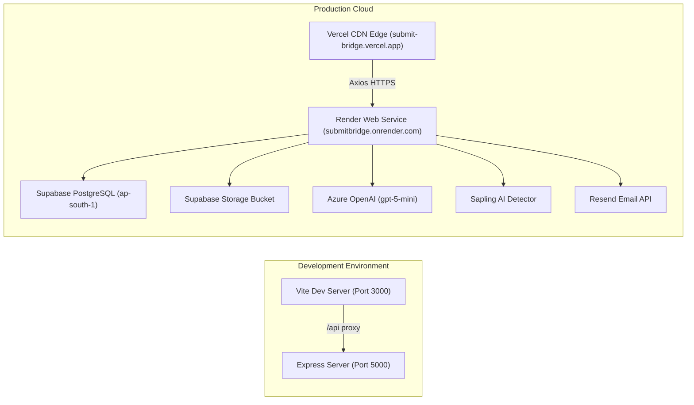

# 02. Technology Stack — SubmitBridge

This document details the complete technology stack, frameworks, runtime environments, libraries, database engines, and third-party APIs implemented in the **SubmitBridge** project.

---

## 1. High-Level Technology Summary

| Tier / Category | Technology | Version | Purpose & Implementation Area |
| :--- | :--- | :--- | :--- |
| **Frontend Framework** | React.js | `^18.3.1` | Single Page Application (SPA), component hierarchy, hooks, state management (`client/src/`) |
| **Frontend Build Tool** | Vite | `^5.4.11` | Development server, Hot Module Replacement (HMR), production bundling |
| **Frontend Routing** | React Router DOM | `^6.28.0` | Client-side routing, protected routes (`PrivateRoute`, `PublicAuthRoute`) |
| **HTTP Client** | Axios | `^1.7.9` | Asynchronous REST API requests, interceptors for JWT Bearer token injection |
| **Frontend Supabase SDK** | `@supabase/supabase-js` | `^2.115.0` | Client-side Google OAuth authentication session management (`supabaseClient.js`) |
| **Client QR Generator** | QRCode | `^1.5.4` | Canvas / Data URL rendering for assignment links (`AssignmentQrCard.jsx`) |
| **Styling & Design** | Vanilla CSS | Custom | Custom CSS variables, responsive grid, glassmorphism, badge & card system (`global.css`) |
| **Backend Runtime** | Node.js | `>=18.x` | Asynchronous event-driven server runtime environment |
| **Backend Web Framework** | Express.js | `^4.21.2` | RESTful API routing, middleware chaining, JSON parsing, error handling (`server/server.js`) |
| **Database Engine** | PostgreSQL (Supabase) | `17.6` | Relational database hosting `teachers`, `assignments`, and `submissions` |
| **Backend Supabase SDK**| `@supabase/supabase-js` | `^2.49.1` | Server-side database queries and storage bucket management using Service Role / Anon Key |
| **Object File Storage** | Supabase Storage | S3-compatible | Public cloud bucket (`submissions`) storing uploaded PDF and DOCX files |
| **Password Hashing** | bcryptjs | `^2.4.3` | One-way password hashing with salt rounds (`10`) for faculty accounts |
| **Session Security** | JSON Web Tokens (`jsonwebtoken`)| `^9.0.2` | Stateless authorization tokens signed with HMAC-SHA256, 7-day expiration |
| **Multipart Ingestion** | Multer | `^1.4.5-lts.1` | Memory-storage buffer ingestion of files up to 10MB without writing to server disk |
| **PDF Extraction Engine** | `pdf-parse` + Custom Stream Decompressor | `^1.1.4` | In-memory text extraction from student PDF submissions |
| **DOCX Extraction Engine**| `mammoth` | `^1.9.0` | In-memory raw text extraction from student Word documents |
| **AI Evaluation LLM** | Azure OpenAI Service | `gpt-5-mini` | Academic grading, evaluation summary, and marking justification generation |
| **AI Content Detection**| Sapling AI Detector API | v1 API | AI-generated text likelihood percentage calculation with round-robin multi-key rotation |
| **Transactional Email** | Resend SDK / Brevo API | `resend: ^6.26.0` | Dispatching 6-digit faculty registration verification OTP emails |
| **Frontend Deployment** | Vercel | Cloud CDN | Deployed at `https://submit-bridge.vercel.app/` with client routing rewrites |
| **Backend Deployment** | Render | Cloud Container | Deployed at `https://submitbridge.onrender.com/` (Docker / Node.js web service) |

---

## 2. Frontend Technologies & Package Details

### `client/package.json` Inspection
```json
{
  "name": "submitbridge-client",
  "private": true,
  "version": "1.0.0",
  "type": "module",
  "scripts": {
    "dev": "vite",
    "build": "vite build",
    "preview": "vite preview"
  },
  "dependencies": {
    "@supabase/supabase-js": "^2.115.0",
    "axios": "^1.7.9",
    "qrcode": "^1.5.4",
    "react": "^18.3.1",
    "react-dom": "^18.3.1",
    "react-router-dom": "^6.28.0"
  },
  "devDependencies": {
    "@vitejs/plugin-react": "^4.3.4",
    "vite": "^5.4.11"
  }
}
```

### Explanations:
1. **React (`^18.3.1`) & React DOM:** Powers the component-driven user interface. Uses modern React patterns including custom hooks (`useAuth`, `useAssignments`), Context API (`AuthContext`, `AssignmentsContext`), controlled forms, and conditional rendering.
2. **Vite (`^5.4.11`):** Fast ESM-based frontend build tool. In development mode, Vite proxies `/api` requests to `http://localhost:5000` to prevent CORS issues locally.
3. **React Router DOM (`^6.28.0`):** Manages single-page navigation without reloading. Configures guarded routes:
   - `PrivateRoute`: Blocks unauthenticated faculty and redirects to `/login`.
   - `PublicAuthRoute`: Prevents logged-in faculty from seeing login/registration pages, redirecting directly to `/dashboard`.
   - Dynamic parameters: `/submit/:assignmentId` for students and `/assignment/:id` for faculty details.
4. **Axios (`^1.7.9`):** Configured as a centralized API service in `client/src/api.js`. Contains request interceptors to automatically extract the JWT token from `localStorage` and inject `Authorization: Bearer <token>` into outbound requests.
5. **@supabase/supabase-js (`^2.115.0`):** Used in the browser for Google OAuth flows (`supabase.auth.signInWithOAuth`) on both faculty login and student submission identity verification.
6. **QRCode (`^1.5.4`):** Converts the public shareable submission link into a high-contrast base64 Data URL for classroom projection and mobile scanning.
7. **Vanilla CSS (`global.css`):** Comprehensive 60KB design system with CSS custom properties (`--sb-primary`, `--sb-slate`, `--sb-emerald`), responsive flexbox/grid layouts, custom scrollbars, animated spinners, card skeletons, and modal overlays.

---

## 3. Backend Technologies & Package Details

### `server/package.json` Inspection
```json
{
  "name": "submitbridge-server",
  "version": "1.0.0",
  "description": "SubmitBridge Backend Server",
  "main": "server.js",
  "scripts": {
    "start": "node server.js",
    "dev": "node --watch-path=server.js --watch-path=routes --watch-path=middleware --watch-path=services --watch-path=supabase.js server.js"
  },
  "dependencies": {
    "@supabase/supabase-js": "^2.49.1",
    "bcryptjs": "^2.4.3",
    "cors": "^2.8.5",
    "dotenv": "^16.4.7",
    "express": "^4.21.2",
    "jsonwebtoken": "^9.0.2",
    "mammoth": "^1.9.0",
    "multer": "^1.4.5-lts.1",
    "pdf-parse": "^1.1.4",
    "qrcode": "^1.5.4",
    "resend": "^6.26.0"
  }
}
```

### Explanations:
1. **Express.js (`^4.21.2`):** Core application framework handling HTTP routing across three modular route groups:
   - `/api/auth`: Registration, password login, demo login, email verification, Google verification, profile inspection.
   - `/api/assignments`: Creation, listing, retrieval, soft deletion, and restoration.
   - `/api/submissions`: Public assignment retrieval, student submission processing, and grading approval.
2. **Multer (`^1.4.5-lts.1`):** Configured with `multer.memoryStorage()`. Keeps uploaded student documents strictly in RAM buffers, avoiding disk write overhead, temporary file pollution, or uncleaned disk leaks on serverless/container hosts.
3. **pdf-parse (`^1.1.4`) & Custom Stream Fallback (`zlib`):** Extracts text from standard PDF documents. Augmented by a proprietary Node.js stream-decompression engine in `server/services/aiService.js` that handles FlateDecode/ASCII85 streams and Tj/TJ PDF text operators when third-party PDF generators (such as ReportLab) introduce syntax anomalies.
4. **mammoth (`^1.9.0`):** Converts `.docx` byte arrays directly to raw ASCII/UTF-8 text by extracting document XML structures without requiring Microsoft Office binaries.
5. **bcryptjs (`^2.4.3`):** Hashes teacher passwords with salted cryptographic routines before saving them to Supabase, guaranteeing that plain-text passwords never exist in database records.
6. **jsonwebtoken (`^9.0.2`):** Issues signed JWT tokens bearing the teacher's UUID, name, email, and college. Verified on protected routes by `server/middleware/auth.js`.
7. **Resend (`^6.26.0`):** Modern developer email API used in `server/services/emailService.js` to deliver responsive HTML emails containing 6-digit OTP codes to new faculty registrants.

---

## 4. Database & Storage Platform

### Supabase (PostgreSQL 17.6)
- **Database Engine:** Managed PostgreSQL version `17.6.1.166` hosted on AWS Mumbai region (`ap-south-1`).
- **Access Protocol:** PostgREST REST API over HTTPS and direct connection via `@supabase/supabase-js`.
- **Relational Tables:**
  1. `teachers`: Faculty authentication and institutional affiliation.
  2. `assignments`: Coursework specifications, questions, rules, deadlines, and link metadata.
  3. `submissions`: Student records, storage URLs, AI grades, detection scores, and final grades.
- **Supabase Storage:**
  - Bucket: `submissions` (Public read access enabled).
  - Storage path structure: `{assignment_id}/{roll_number}-{timestamp}.{ext}`.
  - Lifecycle: Automated removal of previous submission files upon resubmission.

---

## 5. Artificial Intelligence Services

### 1. Azure OpenAI Service (`gpt-5-mini`)
- **Deployment Name:** `gpt-5-mini` (configurable via `AZURE_OPENAI_DEPLOYMENT_NAME`).
- **API Version:** `2024-08-01-preview` Chat Completions API.
- **Protocol:** HTTPS POST request with `api-key` header and `response_format: { type: "json_object" }`.
- **Functionality:** Ingests assignment subject, title, instructions, questions, maximum marks, and cleaned student document text. Evaluates work in isolation and outputs estimated marks (strictly bounded within `[0, maxMarks]`), a 2-3 sentence summary, and a marking justification.

### 2. Sapling AI Content Detector API
- **Endpoint:** `https://api.sapling.ai/api/v1/aidetect`
- **Protocol:** RESTful HTTPS POST transmitting JSON `{ key, text }`.
- **Resilience Engine:** Implemented with stateful round-robin key rotation across up to 10 configured API keys (`SAPLING_API_KEYS`, `SAPLING_API_KEY1`, `SAPLING_API_KEY2`, etc.). If one key triggers a rate-limit or quota error, the server automatically tries the next key within the same request lifecycle.
- **Functionality:** Returns a raw float between `0.0` and `1.0`, converted by the backend to an integer percentage (`0%` to `100%` AI likelihood).

---

## 6. Build, Development & Deployment Architecture


