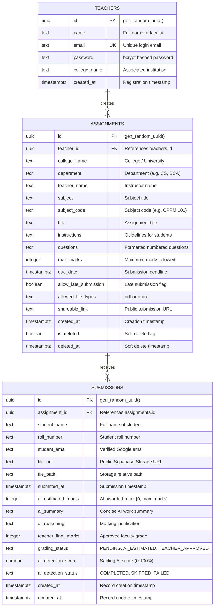

# 04. Database Documentation — SubmitBridge

This document provides complete technical documentation for the relational database layer of **SubmitBridge**, hosted on **Supabase (PostgreSQL 17.6)**.

---

## 1. Database Management System (DBMS) Overview

- **Engine:** PostgreSQL 17.6 (Managed by Supabase)
- **Host Region:** AWS ap-south-1 (Mumbai)
- **Primary Schema:** `public`
- **Authentication Scheme:** Direct client connection via PostgREST and `@supabase/supabase-js` using backend service-role privileges.
- **Object Storage Integration:** Managed Supabase Storage bucket (`submissions`) linked with table file path references.

---

## 2. Entity-Relationship (ER) Architecture

The SubmitBridge data model comprises three relational entities:

1. **`teachers` (Faculty Accounts):** Represents verified faculty members who create assignments.
2. **`assignments` (Coursework):** Represents academic assignments configured by faculty, linked to `teachers` via `teacher_id`.
3. **`submissions` (Student Work):** Represents student submissions, linked to `assignments` via `assignment_id`.

---

## 3. Detailed Data Dictionary

### Table 1: `teachers`
Stores faculty profile, institutional identity, and cryptographic credentials.

| Column Name | Data Type | Nullable | Default | Constraints | Description |
| :--- | :--- | :--- | :--- | :--- | :--- |
| `id` | `uuid` | NO | `gen_random_uuid()` | PRIMARY KEY (`teachers_pkey`) | Unique identifier for faculty member |
| `name` | `text` | NO | *None* | *None* | Full name of the faculty member |
| `email` | `text` | NO | *None* | UNIQUE (`teachers_email_key`) | Official institutional email address |
| `password` | `text` | NO | *None* | *None* | One-way salted bcrypt password hash |
| `college_name` | `text` | YES | *None* | *None* | Institution/College name |
| `created_at` | `timestamptz`| YES | `now()` | *None* | Account registration timestamp |

---

### Table 2: `assignments`
Stores coursework specifications, question lists, deadlines, and link metadata.

| Column Name | Data Type | Nullable | Default | Constraints | Description |
| :--- | :--- | :--- | :--- | :--- | :--- |
| `id` | `uuid` | NO | `gen_random_uuid()` | PRIMARY KEY (`assignments_pkey`) | Unique identifier for assignment |
| `teacher_id` | `uuid` | YES | *None* | FOREIGN KEY (`teachers.id`) | Links assignment to creator faculty |
| `college_name` | `text` | NO | *None* | *None* | Name of the institution |
| `department` | `text` | YES | *None* | *None* | Academic department (e.g. BCA, CS) |
| `teacher_name` | `text` | NO | *None* | *None* | Instructor's display name |
| `subject` | `text` | NO | *None* | *None* | Name of the subject/course |
| `subject_code` | `text` | YES | *None* | *None* | Subject course code (e.g. CPPM 101) |
| `title` | `text` | NO | *None* | *None* | Assignment title/topic |
| `instructions` | `text` | YES | *None* | *None* | Student submission guidelines |
| `questions` | `text` | NO | *None* | *None* | Numbered questions list |
| `max_marks` | `integer` | NO | `100` | *None* | Maximum attainable marks |
| `due_date` | `timestamptz`| YES | *None* | *None* | Strict submission deadline |
| `allow_late_submission` | `boolean` | YES | `true` | *None* | Flag allowing late submissions |
| `allowed_file_types` | `text` | YES | `'pdf'::text` | *None* | Accepted extensions: `'pdf'` or `'pdf,docx'` |
| `shareable_link` | `text` | YES | *None* | *None* | Permanent student submission URL |
| `created_at` | `timestamptz`| YES | `now()` | *None* | Timestamp when assignment was created |
| `is_deleted` | `boolean` | YES | `false` | *None* | Soft deletion state flag |
| `deleted_at` | `timestamptz`| YES | *None* | *None* | Timestamp when moved to trash (3-day purge window) |

---

### Table 3: `submissions`
Stores student records, uploaded file references, AI metrics, and teacher grades.

| Column Name | Data Type | Nullable | Default | Constraints | Description |
| :--- | :--- | :--- | :--- | :--- | :--- |
| `id` | `uuid` | NO | `gen_random_uuid()` | PRIMARY KEY (`submissions_pkey`) | Unique identifier for submission |
| `assignment_id` | `uuid` | YES | *None* | FOREIGN KEY (`assignments.id`) | Links submission to parent assignment |
| `student_name` | `text` | NO | *None* | *None* | Full name entered by student |
| `roll_number` | `text` | NO | *None* | UNIQUE (`unique_assignment_roll` with assignment_id) | Student roll number or ID |
| `student_email` | `text` | YES | *None* | *None* | Verified Google account email |
| `file_url` | `text` | NO | *None* | *None* | Public HTTPS link in Supabase Storage |
| `file_path` | `text` | YES | *None* | *None* | Relative bucket storage path |
| `submitted_at` | `timestamptz`| YES | `now()` | *None* | Initial submission or resubmission timestamp |
| `ai_estimated_marks` | `integer` | YES | *None* | *None* | Marks estimated by Azure OpenAI |
| `ai_summary` | `text` | YES | *None* | *None* | 2-3 sentence AI evaluation summary |
| `ai_reasoning` | `text` | YES | *None* | *None* | AI evaluation justification |
| `teacher_final_marks` | `integer` | YES | *None* | *None* | Final grade assigned or approved by faculty |
| `grading_status` | `text` | YES | `'PENDING'::text` | *None* | Status: `PENDING`, `AI_ESTIMATED`, `TEACHER_APPROVED` |
| `ai_detection_score` | `numeric` | YES | *None* | *None* | Sapling AI likelihood score (0 to 100) |
| `ai_detection_status` | `text` | YES | `'SKIPPED'::text` | *None* | Status: `COMPLETED`, `SKIPPED`, `FAILED` |
| `created_at` | `timestamptz`| YES | `now()` | *None* | Record insertion timestamp |
| `updated_at` | `timestamptz`| YES | `now()` | *None* | Last update / resubmission timestamp |

---

## 4. Key Relationships & Constraints

1. **Teacher to Assignments (`1 : N`):**
   - Each faculty member can create multiple assignments.
   - Foreign key: `assignments.teacher_id -> teachers.id`.
   - On deleting a teacher, assignments are protected or cascaded per administrative policy.
2. **Assignment to Submissions (`1 : N`):**
   - Each assignment receives multiple submissions from students.
   - Foreign key: `submissions.assignment_id -> assignments.id`.
3. **Composite Unique Constraint (`unique_assignment_roll`):**
   - Implemented across `(assignment_id, roll_number)` in `submissions`.
   - Prevents duplicate submission records for the same roll number in an assignment.
4. **Resubmission Overwrite Behavior:**
   - When a student resubmits with the same verified Google email (`student_email`), the backend locates the existing record, uses `file_path` to delete the old document from Supabase Storage, and issues an `UPDATE` query on `submissions`.

---

## 5. Storage Bucket Configuration

- **Bucket Name:** `submissions`
- **Public Visibility:** `TRUE` (allows faculty and students to open document links via direct HTTPS URLs).
- **Allowed MIME Types:** `application/pdf`, `application/vnd.openxmlformats-officedocument.wordprocessingml.document` (enforced at API layer).
- **Object Key Naming Scheme:**
  `{assignment_id}/{roll_number}-{timestamp}.{ext}`
  *(Example: `cbc5efc1-57d0-4291-9893-d7f2785bab46/21CS042-1788802338641.pdf`)*
