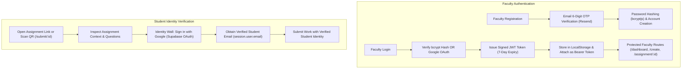

# 07. Authentication & Authorization — SubmitBridge

This document details the authentication models, cryptographic mechanisms, token flows, and authorization access controls implemented across **SubmitBridge**.

---

## 1. Authentication Architecture Overview

SubmitBridge implements a dual-persona authentication model tailored to academic workflows:



---

## 2. Teacher / Faculty Authentication

### A. Registration with 6-Digit Email OTP
To prevent fake faculty accounts and ensure genuine institutional ownership of email addresses, SubmitBridge uses a two-phase registration protocol:

1. **Initiation (`POST /api/auth/register-initiate`):**
   - Faculty enters Name, College/Institution, Email, Password, and Password Confirmation.
   - Backend queries `public.teachers` to guarantee email uniqueness.
   - Backend uses Supabase Admin API (`supabase.auth.admin.generateLink`) or a cryptographically secure random number generator to create a 6-digit numeric OTP.
   - The OTP is formatted into a responsive HTML email and dispatched to the faculty member's inbox via **Resend** (or Brevo SMTP fallback).
2. **Verification & Account Finalization (`POST /api/auth/register-verified`):**
   - Faculty enters the 6-digit OTP received in their email.
   - Client verifies the OTP with Supabase (`supabase.auth.verifyOtp`).
   - Client immediately calls the backend endpoint with verified credentials.
   - The backend hashes the password using `bcryptjs` with 10 salt rounds and creates the row in `public.teachers`.
   - A signed JWT token is returned, immediately logging the teacher in.

### B. Password Login (`POST /api/auth/login`)
- Faculty submits registered email and password.
- Backend fetches the record from `public.teachers`.
- Password verification is performed using `bcrypt.compare(password, teacher.password)`.
- If valid, a JWT token is generated and returned with teacher profile details.

### C. Google OAuth Sign-In (`POST /api/auth/google`)
- Faculty can click **"Continue with Google"** on the login page.
- Browser triggers `supabase.auth.signInWithOAuth({ provider: 'google' })`.
- Upon callback (`#access_token`), the client calls `POST /api/auth/google` with `session.user.email`.
- **Security Guard:** Google login is strictly restricted to already-registered faculty. If an unknown Google email attempts sign-in, the backend returns HTTP 403 Forbidden with `notRegistered: true`, and the frontend immediately clears the Supabase session to prevent orphan logins.

### D. 1-Click Viva Demo Sign-In (`POST /api/auth/demo`)
- Designed specifically for university examiners and viva evaluators to review the platform without manual sign-up.
- Automatically links to a pre-seeded faculty account (`vikram.nit@edu.in` or primary teacher record) and returns a valid JWT.

### E. JSON Web Token (JWT) Specifications
- **Signing Algorithm:** HMAC-SHA256 (`HS256`)
- **Secret Key:** `process.env.JWT_SECRET` (defaults to safe fallback during development)
- **Token Lifespan:** 7 days (`expiresIn: "7d"`)
- **Payload Contents:**
  ```json
  {
    "id": "teacher-uuid-v4",
    "name": "Teacher Full Name",
    "email": "teacher.email@college.edu",
    "collegeName": "Institution Name",
    "iat": 1788800000,
    "exp": 1789404800
  }
  ```

### F. Session Hydration & Expiry Handling
- Stored in browser `localStorage` under keys `token` and `teacher`.
- In `client/src/context/AuthContext.jsx`, during application mount, `getTeacherProfile()` (`GET /api/auth/me`) is dispatched.
- If the token is expired or altered, the server returns HTTP 401, and the client automatically purges `localStorage`, resetting the user to the login screen.

---

## 3. Student Authentication & Identity Verification

### Frictionless Google OAuth Identity Wall
Unlike traditional LMS platforms that require students to remember separate usernames and passwords, SubmitBridge balances ease-of-use with academic authenticity:

1. Students access the assignment freely via URL or QR code without initial login.
2. They can review assignment instructions, due dates, questions, and guidelines.
3. When ready to submit, an **Identity Verification Wall** requires them to click **"Sign in with Google"**.
4. The client uses `supabase.auth.signInWithOAuth({ provider: 'google' })` with redirect back to the assignment URL.
5. The verified email (`session.user.email`) is locked in the submission form and cannot be edited by the student.
6. The backend verifies `studentEmail` in `req.body`.

### Overwrite Security & Resubmission Protection
- The backend matches submissions based on `(assignment_id, student_email)`.
- If a student uploads a revised document, their prior submission is located, the old file is deleted from Supabase Storage, and the existing database record is updated.
- Students cannot overwrite someone else's assignment because the email is bound to their authenticated Google session.

---

## 4. Protected Routes & Middleware Verification

### Backend Route Guard (`server/middleware/auth.js`)
```javascript
const authMiddleware = (req, res, next) => {
  const authHeader = req.headers.authorization;
  if (!authHeader || !authHeader.startsWith("Bearer ")) {
    return res.status(401).json({ message: "Access denied. No token provided." });
  }
  const token = authHeader.split(" ")[1];
  try {
    const decoded = jwt.verify(token, process.env.JWT_SECRET);
    req.teacher = decoded; // { id, name, email, collegeName }
    next();
  } catch (err) {
    return res.status(401).json({ message: "Invalid or expired token." });
  }
};
```
Every route under `/api/assignments/*` and `/api/submissions/:id/grade` runs this middleware before execution.

### Frontend Route Guards (`client/src/App.jsx`)
- **`PrivateRoute`:** Wraps `/dashboard`, `/create`, and `/assignment/:id`. If `isAuthenticated` is false, redirects to `/login`.
- **`PublicAuthRoute`:** Wraps `/login` and `/register`. If `isAuthenticated` is true, automatically forwards the teacher to `/dashboard`.

---

## 5. Implemented vs. Planned Authentication Features

| Authentication Feature | Current Status | Notes |
| :--- | :--- | :--- |
| **Faculty Email OTP Verification** | ✅ Implemented | Dispatched via Resend / Brevo with 60s cooldown timer |
| **Password Hashing (bcrypt)** | ✅ Implemented | 10 salt rounds before database insertion |
| **JWT Bearer Token Sessions** | ✅ Implemented | 7-day expiration with profile payload |
| **Faculty Google OAuth Sign-in** | ✅ Implemented | Restricted to previously registered faculty |
| **1-Click Viva Demo Sign-in** | ✅ Implemented | Instant login for academic examiners |
| **Student Google Identity Wall** | ✅ Implemented | Supabase OAuth verification on submission portal |
| **Session Hydration & Validation**| ✅ Implemented | Validates token against `/api/auth/me` on mount |
| **Student Dashboard History** | ⏳ Planned | Historical portfolio of student submissions |
| **Refresh Token Rotation** | ⏳ Planned | Automatic silent token refresh |
| **College SSO / SAML** | ⏳ Planned | Restricting student login to `@college.edu` domains |
