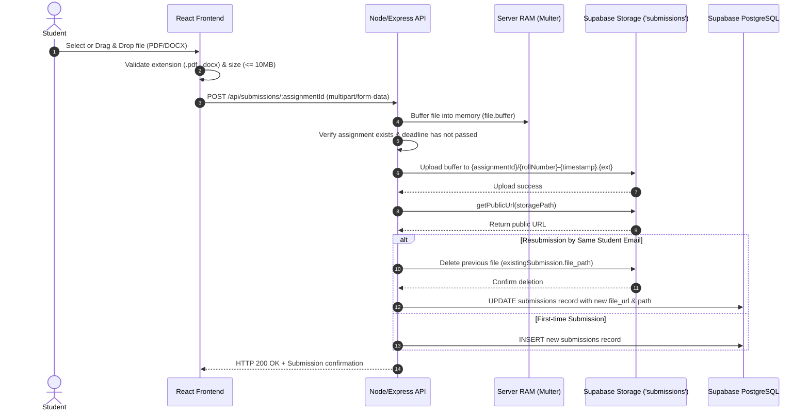

# 08. File Upload & Storage Architecture — SubmitBridge

This document details the file upload lifecycle, document validation, storage bucket infrastructure, naming conventions, and cleanup rules implemented in **SubmitBridge**.

---

## 1. File Upload Specifications

| Parameter | Specification | Enforcement Mechanism |
| :--- | :--- | :--- |
| **Supported File Formats** | PDF (`.pdf`), Word Document (`.docx`) | Client-side extension check + Multer MIME type filter |
| **Maximum File Size** | 10 MB (10,485,760 bytes) | Client-side `file.size` check + Multer `limits.fileSize` |
| **Ingestion Storage Type** | In-Memory RAM Buffer (`multer.memoryStorage()`) | Server RAM (zero temporary files written to disk) |
| **Object Cloud Storage** | Supabase Storage (S3-compatible bucket) | `supabase.storage.from('submissions')` |
| **Bucket Name** | `submissions` | Configured as public read |
| **Access URL Scheme** | `https://<supabase-ref>.supabase.co/storage/v1/object/public/submissions/<path>` | Generated via `supabase.storage.getPublicUrl()` |

---

## 2. Complete File Ingestion Workflow



---

## 3. Storage Key & Naming Strategy

To guarantee absolute uniqueness, avoid race conditions, and organize files logically, documents are stored using a hierarchical path structure:

```text
submissions/
└── {assignmentId}/
    ├── {rollNumber}-{timestamp}.pdf
    └── {rollNumber}-{timestamp}.docx
```

### Example Storage Paths:
- `cbc5efc1-57d0-4291-9893-d7f2785bab46/21CS042-1788802338641.pdf`
- `cbc5efc1-57d0-4291-9893-d7f2785bab46/5432-1788806921766.pdf`

### Sanitization & Collision Prevention:
1. **Roll Number Sanitization:** Cleaned of whitespace and converted to uppercase (`cleanRoll = rollNumber.trim().toUpperCase()`).
2. **Filename Sanitization:** Non-alphanumeric characters (excluding `.` and `-`) are stripped or replaced with underscores (`file.originalname.replace(/[^a-zA-Z0-9._-]/g, "_")`).
3. **Timestamp Salt:** Appending `Date.now()` ensures that even if a student re-uploads a file with the same name, the storage key is distinct, preventing CDN caching stale copies.

---

## 4. Multi-Layer File Validation

SubmitBridge enforces validation at three distinct checkpoints:

### 1. Client-Side Validation (`FileDropZone.jsx` & `StudentSubmit.jsx`)
- Prevents uploading unsupported file types immediately before network transmission:
  ```javascript
  const isPdf = file.name.toLowerCase().endsWith('.pdf') || file.type === 'application/pdf';
  const isDocx = file.name.toLowerCase().endsWith('.docx') || file.type.includes('wordprocessingml');
  if (!isPdf && !(isDocx && isDocxAllowed)) {
    setFileError('⚠️ Only PDF or Word documents are accepted.');
    return;
  }
  if (file.size > 10 * 1024 * 1024) {
    setFileError('⚠️ File size exceeds 10MB limit.');
    return;
  }
  ```

### 2. Multer Engine Validation (`server/routes/submissions.js`)
- Enforces strict memory quotas and MIME type filters on incoming HTTP request streams:
  ```javascript
  const upload = multer({
    storage: multer.memoryStorage(),
    limits: { fileSize: 10 * 1024 * 1024 }, // 10MB
    fileFilter: (req, file, cb) => {
      const isAllowed =
        file.mimetype === "application/pdf" ||
        file.mimetype === "application/x-pdf" ||
        file.mimetype.includes("wordprocessingml") ||
        file.originalname.toLowerCase().endsWith(".pdf") ||
        file.originalname.toLowerCase().endsWith(".docx");
      if (isAllowed) cb(null, true);
      else cb(new Error("Invalid file type. Only PDF and DOCX files are allowed."), false);
    },
  });
  ```

### 3. Database & Assignment Rule Enforcement
- Cross-references the teacher's assignment configuration (`allowed_file_types`). If a teacher specifies only PDF, DOCX uploads are rejected by the client validation.

---

## 5. Resubmission & Garbage Collection Strategy

In educational systems, students often submit revised versions of their coursework before the deadline (fixing formatting, adding missing answers, etc.). 

If prior submissions were retained indefinitely, the cloud storage bucket would quickly fill with orphaned, redundant files. SubmitBridge implements an automated replacement policy:

1. Before saving the new submission, the backend checks for an existing record matching the current `assignment_id` and verified `student_email`.
2. If found, the server retrieves `existingSubmission.file_path`.
3. An asynchronous removal command is issued to Supabase Storage:
   ```javascript
   if (existingSubmission && existingSubmission.file_path) {
     await supabase.storage
       .from("submissions")
       .remove([existingSubmission.file_path]);
   }
   ```
4. The database row is updated with the new `file_url`, `file_path`, and new timestamp.
5. Result: Exactly one active file exists per student per assignment in both storage and database.

---

## 6. Security Considerations

1. **Zero Server Disk Footprint:** Because Multer uses memory buffers, malicious files are never written to the host filesystem, neutralizing local file execution, shell scripts, or symlink exploits.
2. **Buffer Release:** File buffers are discarded by the JavaScript garbage collector once the upload and text extraction routines complete.
3. **Public URL Safety:** Storage files are read-only. Uploads and deletions require the backend service-role key, meaning unauthorized users cannot delete files from the bucket.
