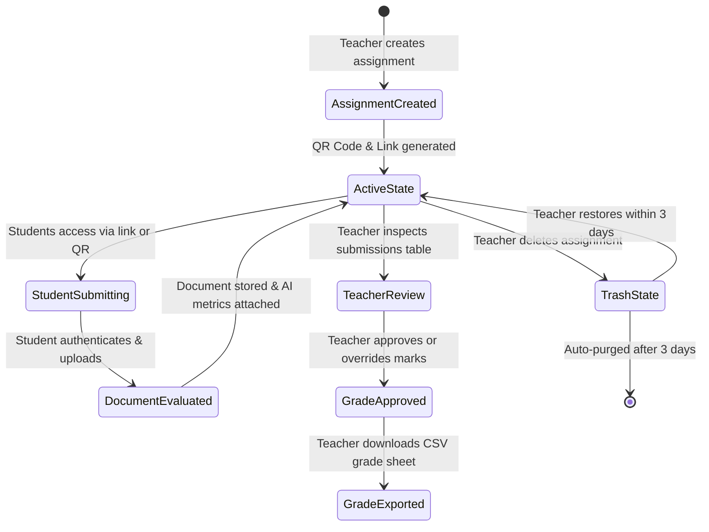

# 09. Assignment Workflow — SubmitBridge

This document describes the end-to-end academic lifecycle of assignments within **SubmitBridge**, detailing both the Faculty and Student workflows based strictly on the current working code.

---

## 1. High-Level Lifecycle Diagram

---

## 2. Faculty / Teacher Workflow

### Step 1: Authentication & Access
1. Faculty navigates to `/login` or `/register`.
2. Can authenticate using:
   - Registered email and password.
   - Verified Google OAuth ("Continue with Google").
   - 1-Click Viva Demo Sign-In for evaluators.
3. Upon successful authentication, a 7-day JWT is stored in `localStorage`, and the user is redirected to the `/dashboard`.

### Step 2: Accessing the Dashboard
1. The dashboard displays:
   - Personalized greeting banner (`DashboardHero.jsx`).
   - Summary stat widgets: Total Active Assignments and Archived in Trash.
   - Segmented tabs: **Active Assignments** and **Trash**.
2. Each assignment card shows subject code, department, title, max marks, submission count, due date, status pill, and action buttons ("View Submissions", "Copy Link", "Delete Assignment").

### Step 3: Creating a New Assignment
1. Faculty clicks **"New Assignment"** in the navigation bar or "+ Create Your First Assignment" button.
2. The teacher completes the structured coursework form (`CreateAssignment.jsx`):
   - **Institution / College Name:** Auto-populated from faculty profile or manually entered.
   - **Department:** Academic branch (e.g. Computer Applications, BCA).
   - **Subject Name & Subject Code:** Course identifier (e.g., `C++ Programming`, `CPPM 101`).
   - **Assignment Title:** Topic title (e.g., `Assignment 3: Pointer Operations`).
   - **Instructions / Guidelines:** Specific student guidelines (formatting, structure).
   - **Dynamic Question List:** Individual question input boxes with "Add Question" and "Remove" controls. If multiple questions are pasted together, the system automatically splits them into separate inputs.
   - **Maximum Marks:** Point scale (e.g. 5, 20, 100).
   - **Submission Deadline:** Date and time picker for automated submission closure.
   - **Allowed File Formats:** Checkboxes for PDF and DOCX.
3. Faculty submits the form (`POST /api/assignments`).

### Step 4: Link & QR Code Generation
1. Upon creation, the server immediately computes the permanent URL:
   `https://submit-bridge.vercel.app/submit/{assignment_id}`
2. The server generates a base64 Data URL QR code image.
3. The frontend displays `CreateAssignmentSuccess.jsx` modal with the QR code and a 1-click **"Copy Link"** button for sharing with students via WhatsApp, email, or classroom projection.

### Step 5: Monitoring Submissions in Real Time
1. Teacher clicks **"View Submissions"** on any assignment card (`/assignment/:id`).
2. The view displays:
   - **Hero Card:** Subject code, department, title, guidelines, questions, deadline, and total submission count.
   - **Permanent QR Card:** Interactive QR code and link copy button.
   - **Submissions Table (`SubmissionsTable.jsx`):** Filterable by search (Name, Roll No, Email) and status tabs (`All`, `Approved`, `Pending`).
3. For each submission row, the teacher observes:
   - Student Name, Roll Number, and verified Google Email.
   - Submission date and time formatted locally.
   - **"View Doc"** button linking directly to the uploaded file in Supabase Storage.
   - **AI Likelihood Badge:** Colored percentage badge (Emerald `<20%`, Amber `20-50%`, Red `>50%`).
   - **AI Estimated Marks:** Advisory score with an **"AI Summary →"** button.
   - **Inline Grade Input:** Numeric input pre-populated with AI score or saved grade.
   - **"Approve" Action Button:** One-click confirmation of final marks.
   - **Status Badge:** `Submitted`, `AI Evaluated`, or `Verified`.

### Step 6: Reviewing AI Assessment & Summary Modal
1. Teacher clicks **"AI Summary →"** on any student row.
2. `AISummaryModal.jsx` opens, displaying:
   - Student Name and Roll Number.
   - Estimated AI Score / Max Marks.
   - **Submission Summary:** 2-3 sentence overview of what the student accomplished.
   - **Marking Justification & Rationale:** Specific reasons why marks were awarded or deducted.
3. Teacher closes the modal and retains full autonomy to adjust or accept the mark.

### Step 7: Finalizing Grades & Overriding Marks
1. Teacher modifies the number in the inline points input if desired.
2. Teacher clicks **"Approve"** (`PATCH /api/submissions/:id/grade`).
3. The button state changes to a green checkmark **"Approved"**, and status updates to `Verified`.

### Step 8: Exporting CSV Grade Spreadsheet
1. Teacher clicks the **"Export CSV"** button above the submissions table.
2. The browser generates and downloads a formatted CSV spreadsheet:
   - Filename: `{assignment_title}_submissions.csv`
   - Columns: Roll Number, Student Name, Student Email, Submitted At, AI Score (%), AI Estimated Marks, Final Grade, Status.

### Step 9: Assignment Lifecycle & Deletion
1. Teacher clicks the trash icon on an assignment card.
2. An interactive browser alert asks to confirm moving the assignment to trash.
3. The assignment is moved to the **Trash** tab with a 3-day recovery window.
4. During these 3 days, teacher can click **"Restore"** to reactivate submissions.
5. After 3 days, background database queries automatically purge expired trash.

---

## 3. Student Submission Workflow

### Step 1: Accessing the Portal
1. Student opens the shared assignment URL or scans the QR code on their smartphone or laptop (`/submit/:assignmentId`).
2. The student gateway renders the institutional header, course code, subject, instructor name, and submission deadline.
3. The student reviews the guidelines and the complete list of assignment questions.

### Step 2: Deadline Verification Check
- The client checks `isOverdue(assignment.due_date)` against current local time.
- If the deadline has expired, an alert informs the student:
  `"The due date & time for this assignment has passed. Submissions are now closed."`
  The submission form is locked.

### Step 3: Google Identity Verification
1. To ensure authentic student identity without forced account registration, an **Identity Verification Wall** requires Google authentication.
2. Student clicks **"Sign in with Google"**.
3. Upon redirection, the student's verified Google account profile is displayed with their photo and email.

### Step 4: Filling Submission Details
1. Student enters:
   - **Full Name:** (e.g., `Saurabh Maurya`)
   - **Roll Number / Student ID:** (e.g., `21CS042`)
2. The student's verified email is automatically bound to the form and locked.

### Step 5: Document Upload & Client Validation
1. Student drags and drops or browses for their assignment document into `FileDropZone.jsx`.
2. Format validation immediately confirms the file is PDF or DOCX (matching `allowed_file_types`).
3. Size validation confirms the file does not exceed the **10MB** ceiling.
4. The selected filename and size are displayed with a remove/replace action.

### Step 6: Submitting the Coursework
1. Student clicks **"Submit Assignment Now →"**.
2. The client compiles a `FormData` payload and posts to `/api/submissions/:assignmentId`.
3. The backend executes the ingestion pipeline:
   - Uploads file buffer to Supabase Storage.
   - Deletes prior file if the student is resubmitting.
   - Extracts text (`pdf-parse` or `mammoth`).
   - Dispatches text to Azure OpenAI (`gpt-5-mini`) and Sapling AI.
   - Stores submission record in Supabase PostgreSQL.

### Step 7: Submission Receipt & Confirmation
1. Upon successful upload, `SubmissionSuccess.jsx` is rendered.
2. The student receives:
   - Confirmation message ("Submission successful! Your assignment has been recorded.").
   - Assigned Submission ID.
   - Download/review link for the uploaded document.
   - Immediate feedback that their submission is logged and awaiting teacher review.

### Step 8: Resubmission & Revision Capability
- If a student realizes they made a mistake in their submitted PDF, they can return to the same assignment link with their Google account.
- Submitting again replaces their old file in cloud storage and updates the database record with the new file and new AI evaluation.
