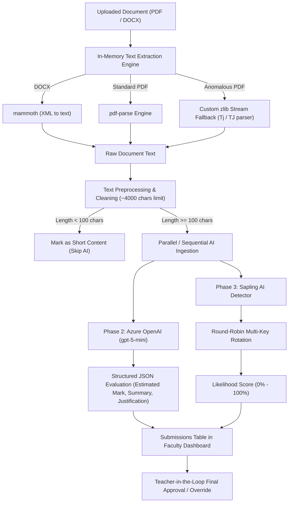
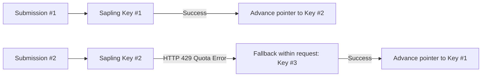

# 10. AI Features & Evaluation Pipeline — SubmitBridge

This document details the Artificial Intelligence architectures, Large Language Model (LLM) prompts, text extraction engines, scoring boundaries, and AI content detection mechanisms implemented in **SubmitBridge** (`server/services/aiService.js`).

---

## 1. AI Architecture Overview

SubmitBridge incorporates an intelligent, multi-stage document processing and evaluation pipeline:



---

## 2. Text Extraction & Preprocessing Engine

Student coursework documents arrive as binary buffers via Multer. The system extracts plain text without writing temporary files to the server disk.

### A. Dual-Engine Extraction Strategy (`extractTextFromFile`)
1. **DOCX Parsing:**
   - Powered by `mammoth.extractRawText({ buffer })`.
   - Directly converts `.docx` XML packages into a unified string.
2. **Standard PDF Parsing:**
   - Powered by `pdf-parse(buffer)`.
   - Reads standard font mappings and text streams.
3. **Proprietary PDF Stream Fallback (`extractPdfStreamsFallback`):**
   - Certain academic PDF generators (e.g., Python ReportLab, legacy LaTeX exporters) create syntax anomalies that cause standard parsers to fail or return empty strings.
   - SubmitBridge implements an in-memory stream parser:
     - Locates binary stream boundaries (`stream ... endstream`).
     - Attempts direct `zlib.inflateSync` decompression (FlateDecode).
     - If compressed via ASCII85, decodes ASCII85 chunks before running Flate decompress.
     - Parses low-level PDF text operators: `(string) Tj` and array `[(string) -20 (more)] TJ`.
     - Scans raw printable literal strings as a final safety fallback.

### B. Text Sanitization (`cleanExtractedText`)
Raw document text is normalized before being sent to LLMs to minimize token consumption and strip out noise:
- Strips redundant metadata labels (e.g., `Name:`, `Roll No:`, `Date:`, `Page X`).
- Collapses consecutive whitespace and empty lines into single line breaks.
- Truncates content to a maximum ceiling of **4,000 characters** (~800-1000 tokens), capturing the core academic substance while avoiding quota exhaustion.

---

## 3. Phase 2: Azure OpenAI Grading Assistant (`gpt-5-mini`)

### A. Service Specifications
- **Provider:** Microsoft Azure OpenAI Service
- **Model Deployment:** `gpt-5-mini` (customizable via `AZURE_OPENAI_DEPLOYMENT_NAME`)
- **API Endpoint:** `https://<resource>.openai.azure.com/openai/deployments/gpt-5-mini/chat/completions?api-version=2024-08-01-preview`
- **Output Mode:** Strict JSON object (`response_format: { type: "json_object" }`)

### B. Prompt Architecture & Constraints
The prompt enforces isolation (assessing each student purely against assignment criteria rather than peer comparison) and strict mathematical boundary containment:

#### System Prompt
```text
You are an academic evaluation assistant for college assignments.
Your task is to review the student's submission in isolation based ONLY on the provided assignment questions and max marks.
Do NOT compare this submission to any other student.
CRITICAL CONSTRAINT: The maximum possible mark for this assignment is {maxMarks}. You MUST NEVER award more than {maxMarks} marks under any circumstance.
Always output a valid JSON object matching this schema exactly:
{
  "estimatedMarks": <number between 0 and {maxMarks}>,
  "summary": "<2-3 sentence concise summary of the student's work>",
  "reasoning": "<1-2 sentence brief justification for the estimated score>"
}
```

#### User Prompt
```text
Subject: {subject}
Assignment Title: {title}
Instructions: {instructions}
Questions:
{questions}
Maximum Marks: {maxMarks} (Strict limit: 0 to {maxMarks})

Student's Submitted Content:
{studentText}

Evaluate and provide the JSON assessment. Ensure estimatedMarks is between 0 and {maxMarks}:
```

### C. Mathematical Clamping & Retry Circuit
LLMs occasionally hallucinate scores outside requested ranges. SubmitBridge protects academic integrity with triple-layered validation:
1. **Response Validation:** Checks that `estimatedMarks` is a valid number.
2. **Automated Re-prompting:** If the model awards a mark greater than `maxMarks` or less than `0`, the server logs a warning and automatically re-prompts the model (up to 2 retry attempts).
3. **Hard Clamping Protection:**
   ```javascript
   marks = Math.max(0, Math.min(Number(maxMarks), Math.round(marks)));
   ```
   Guarantees mathematically that `0 <= aiEstimatedMarks <= maxMarks`.

---

## 4. Phase 3: Sapling AI Content Detection

### A. Service Specifications
- **Provider:** Sapling AI Detector API
- **Endpoint:** `https://api.sapling.ai/api/v1/aidetect`
- **Payload:** JSON `{ "key": "<sapling_key>", "text": "<cleaned_text>" }`
- **Metric Returned:** `data.score` (Float `0.0` to `1.0`)
- **Conversion:** Converted to an integer percentage: `Math.round(rawScore * 100)`.

### B. Multi-Key Round-Robin Rotation System
Because free-tier AI detector keys have strict daily request quotas, SubmitBridge implements a stateful round-robin rotation mechanism across up to 10 keys:



- Keys can be declared either as a comma-separated list (`SAPLING_API_KEYS=key1,key2,key3`) or individual variables (`SAPLING_API_KEY1`, `SAPLING_API_KEY2`).
- Comments and trailing spaces are automatically cleaned.
- If a key fails with an HTTP 429 (Rate Limit Exceeded) or network error, the function immediately tries the next key in the pool within the same request lifecycle.

### C. Score Interpretation & Faculty Presentation
The AI likelihood percentage is displayed in the faculty submissions table as a visual status badge:

| Score Range | Badge Color | Icon | Interpretation |
| :--- | :--- | :--- | :--- |
| **0% – 20%** | Emerald Green | `✓` | High probability of human authorship. |
| **21% – 50%** | Amber Yellow | `⚡` | Moderate AI traits or common phrasing detected. |
| **51% – 100%** | Crimson Red | `⚠️` | High likelihood of machine-generated text. |

### D. Purely Informational / Non-Punitive Philosophy
**Crucial Academic Design Principle:**
Sapling AI detection is strictly an advisory signal for the faculty member.
- Submissions are **never** rejected, blocked, or penalized automatically by the AI detector.
- If detection fails or all API keys are exhausted, the submission completes with `ai_detection_status: 'SKIPPED'` or `'FAILED'`, ensuring zero disruption to students.

---

## 5. Teacher-in-the-Loop Governance

In alignment with educational ethics, SubmitBridge strictly treats AI output as assistive preliminary input:

1. **Advisory Role Only:** Marks generated by Azure OpenAI are stored in `ai_estimated_marks` with initial status `AI_ESTIMATED`.
2. **Full Review Capability:** Faculty can view the full rationale in `AISummaryModal.jsx`.
3. **Human Final Authority:** No grade becomes final until the teacher approves it. The teacher can overwrite the numeric value at will. Upon clicking **"Approve"**, the value is written to `teacher_final_marks`, and status transitions to `TEACHER_APPROVED`.

---

## 6. Unimplemented / Future AI Features

The following features are **not** present in the current version:
- Automated OCR on scanned handwritten documents (currently relies on text extraction from typed PDF/DOCX).
- Intra-class plagiarism detection (comparing student submissions against each other).
- Multi-modal vision analysis of embedded charts, diagrams, or circuits.
