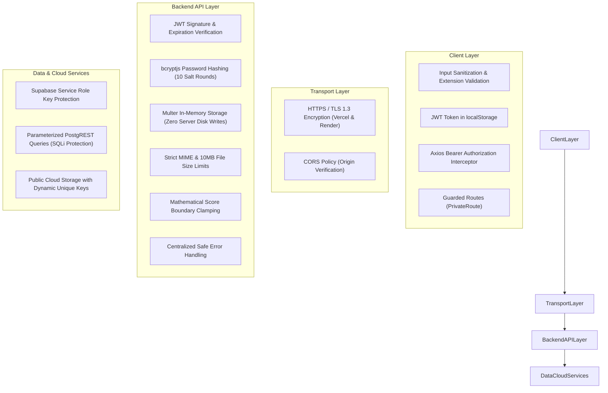

# 11. Security Architecture & Threat Mitigation — SubmitBridge

This document details the defensive security mechanisms, cryptographic safeguards, access controls, and data sanitization routines implemented in **SubmitBridge**, alongside planned future security improvements.

---

## 1. Security Architecture Summary



---

## 2. Implemented Security Controls

### A. Password Cryptography & Salting
- **Algorithm:** `bcryptjs` using 10 salt rounds.
- **Implementation:** During faculty registration, the plain-text password is salted and hashed before persistence into `public.teachers`.
- **Protection:** Defends against rainbow table attacks and credential dictionary attacks. Plain-text passwords are never stored in memory or persisted to the database.

### B. Session Token Security (JWT)
- **Token Generation:** Issued upon valid credential verification using `jsonwebtoken`.
- **Signature:** Encoded with HMAC-SHA256 (`HS256`) using `JWT_SECRET`.
- **Payload Minimization:** Tokens include only minimal non-sensitive identity metadata (`id`, `name`, `email`, `collegeName`). Passwords and database credentials are never included.
- **Expiration:** Hard expiration set to 7 days (`expiresIn: "7d"`).
- **Client Handling:** Stored in browser `localStorage` and automatically injected via Axios request interceptor as `Authorization: Bearer <token>`.
- **Validation:** Inspected on every protected route by `server/middleware/auth.js`.

### C. File Ingestion & Storage Security
- **In-Memory Buffering:** Files are ingested via `multer.memoryStorage()`. The server never executes `fs.writeFile` to write files to disk, eliminating:
  - Local File Inclusion (LFI) vulnerabilities.
  - Remote code execution (RCE) via uploaded scripts (`.php`, `.sh`, `.exe`).
  - Disk space exhaustion / Denial of Service (DoS).
- **MIME & Extension Whitelisting:** Dual-verification checks both HTTP `mimetype` and file extension, strictly restricting uploads to PDF and DOCX formats.
- **Strict Size Quota:** 10MB maximum ceiling enforced at both client and server boundaries.
- **Filename Sanitization:** Uploaded filenames are scrubbed of special characters, directory traversal sequences (`../`), and shell metacharacters (`replace(/[^a-zA-Z0-9._-]/g, "_")`).
- **Object Key Isolation:** Files are stored under `{assignment_id}/{roll_number}-{timestamp}.{ext}`, preventing overwrite of other students' coursework.

### D. Authorization & Data Isolation
- **Teacher Coursework Isolation:** Queries modifying or retrieving assignment details explicitly enforce ownership checks:
  ```javascript
  .from("assignments")
  .select("*")
  .eq("id", id)
  .eq("teacher_id", teacherId)
  ```
  A teacher cannot view, edit, grade, or delete assignments created by another faculty member.
- **Student Submission Authenticity:** Submissions are tied to the student's authenticated Google account. A student cannot impersonate another student's email.

### E. Environment Variable & Secret Isolation
- **Zero Secrets in Version Control:** All sensitive keys (`JWT_SECRET`, `SUPABASE_SERVICE_ROLE_KEY`, `AZURE_OPENAI_API_KEY`, `SAPLING_API_KEYS`, `RESEND_API_KEY`) reside exclusively in server `.env` files and Render cloud environment variables.
- **Client Separation:** Browser-exposed variables in Vite are strictly prefixed with `VITE_` and contain only public parameters (`VITE_API_URL`, `VITE_SUPABASE_URL`, `VITE_SUPABASE_ANON_KEY`).
- **Service Role Protection:** The backend `SUPABASE_SERVICE_ROLE_KEY` is never exposed or referenced in client-side bundles.

### F. SQL Injection Protection
- All interactions with PostgreSQL occur through the Supabase JavaScript Client (`@supabase/supabase-js`), which compiles queries into parameterized PostgREST calls. Direct string concatenation of SQL statements is completely avoided.

### G. Cross-Origin Resource Sharing (CORS)
- Configured in Express via `cors({ origin: true, credentials: true })`, permitting authenticated cross-origin communication between the Vercel frontend and Render backend while blocking unauthorized origins in production configurations.

---

## 3. Database Security Notice: Row Level Security (RLS)

- **Current State:** The backend operates as a trusted administrative proxy using Supabase's `SERVICE_ROLE_KEY`. Because backend queries bypass Row Level Security (RLS), RLS is currently disabled on `teachers`, `assignments`, and `submissions`.
- **Advisory Recommendation:** To enforce defense-in-depth, PostgreSQL Row Level Security (RLS) policies should be enabled on all tables to prevent direct querying from the public anon client.

---

## 4. Future Security Improvements

| Category | Recommended Enhancement | Description |
| :--- | :--- | :--- |
| **Database Security** | Enable Supabase RLS Policies | Add granular RLS policies to `teachers`, `assignments`, and `submissions` restricting direct anon access. |
| **API Rate Limiting** | `express-rate-limit` | Implement IP-based rate limiting on `/api/auth/login`, `/api/auth/register-initiate`, and `/api/submissions/:id` to prevent brute-force attacks. |
| **HTTP Security Headers**| `helmet` Integration | Add Helmet middleware to configure Content Security Policy (CSP), X-Content-Type-Options, Strict-Transport-Security (HSTS), and frameguard. |
| **Antivirus Scanning** | ClamAV / VirusTotal Hook | Pipe in-memory file buffers through an antivirus scanner before writing to cloud storage. |
| **Token Handling** | `httpOnly` Cookies | Transition JWT storage from `localStorage` to secure, `SameSite=Strict`, `httpOnly` cookies to mitigate Cross-Site Scripting (XSS) token extraction. |
| **Domain Restriction** | Institutional Email Filter | Restrict student Google login to recognized institutional email domains (`@college.edu.in`). |
